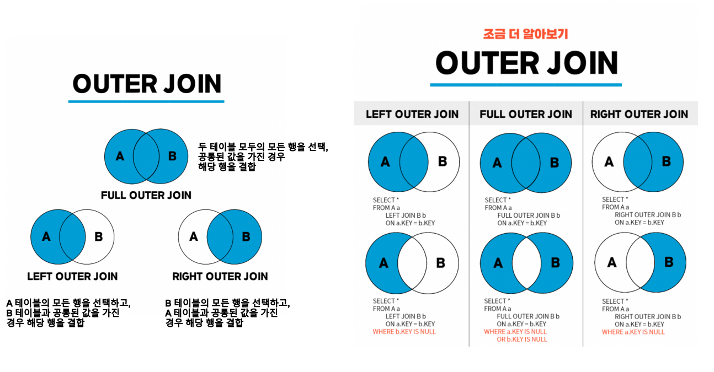

## 1번
[과일로 만든 아이스크림 고르기](https://school.programmers.co.kr/learn/courses/30/lessons/133025)

> 🐹 JOIN문!<br/>
JOIN KEY를 써서 두 테이블을 연결하고, 두 테이블에서 필요한 컬럼들을 가지고 오자.

### 정답
```SQL
SELECT F.FLAVOR
FROM FIRST_HALF F
JOIN ICECREAM_INFO I
ON F.FLAVOR = I.FLAVOR
WHERE F.TOTAL_ORDER > 3000
    AND I.INGREDIENT_TYPE = 'fruit_based'
ORDER BY F.TOTAL_ORDER DESC;
```

### 문제풀이
- JOIN문
```SQL
SELECT <출력할 컬럼>
FROM <테이블1> 
JOIN 테이블2
ON <두 테이블의 연결 조건> (EX. 테이블1.컬럼 = 테이블2.컬럼;)
```



- 기본값 : INNER JOIN (그냥 JOIN이라고만 쓰면 됨)
    - 이외에 RIGHT JOIN, LEFT JOIN은 명시

- 보통 JOIN할 때는 테이블 별칭 지정해서 씀 (AS 생략 가능)
```sql
FROM 테이블1 AS 별칭1
JOIN 테이블2 AS 별칭2
ON 별칭1.컬럼 = 별칭2.컬럼;
```


## 2번
[자동차 종류 별 특정 옵션이 포함된 자동차 수 구하기](https://school.programmers.co.kr/learn/courses/30/lessons/151137)

> 🐹 쿼리 실행 순서를 잘 생각해보자! <br/>
WHERE, GROUP BY를 잘 쓰면 되는 문제다

### 정답
```SQL
SELECT 
    CAR_TYPE,
    COUNT(CAR_TYPE) AS CARS
FROM CAR_RENTAL_COMPANY_CAR
WHERE OPTIONS REGEXP ('통풍시트|열선시트|가죽시트')
GROUP BY CAR_TYPE
ORDER BY CAR_TYPE ASC
```

### 문제 풀이
- WHERE 조건 설정
1. LIKE '%단어%'
```SQL
WHERE OPTIONS LIKE '%통풍시트%' 
  OR OPTIONS LIKE '%열선시트%' 
  OR OPTIONS LIKE '%가죽시트%'
```

2. REGEXP : 정규표현식 사용, 복잡한 패턴에 사용하기 좋음
```SQL
WHERE OPTIONS REGEXP ('통풍시트|열선시트|가죽시트')
```

❗주의)<br/>
OPTIONS 값들은 문자열로, 여러 옵션들이 콤마(',')로 이어져있음.<br/> 
하나의 값에 들어가 있는 옵션은 여러 개이지만 결국에는 하나의 문자열이기 때문에 OPTIONS = '통풍시트' OR '열선시트' OR '가죽시트' 같은 방법을 쓰면 안됨!!! 이렇게 되면 정확히 '통풍시트'인 값만 찾게 됨.<<br/> 
우리는 하나의 문자열 값에 '통풍시트','열선시트','가죽시트' 중 하나 이상 포함된 행을 찾고 싶은거니까 LIKE나 REGEXP를 쓰자.

- **SQL 쿼리 실행 순서**
    1. FROM
    2. WHERE
    3. GROUP BY
    4. HAVING : 그룹화된 데이터 중 조건 설정
    5. SELECT
    6. ORDER BY
    7. LIMIT : 최종적으로 상위 5개 결과만 반환


## 3번
[가장 큰 물고기 10마리 구하기](https://school.programmers.co.kr/learn/courses/30/lessons/298517)

## 4번
[조건에 부합하는 중고거래 상태 조회하기](https://school.programmers.co.kr/learn/courses/30/lessons/164672)

> 🐹 CASE WHEN 사용하기

### 정답
```SQL
SELECT
    BOARD_ID,
    WRITER_ID,
    TITLE,
    PRICE,
    CASE WHEN STATUS = 'SALE' THEN '판매중'
        WHEN STATUS = 'RESERVED' THEN '예약중'
        WHEN STATUS = 'DONE' THEN '거래완료'
        ELSE STATUS END AS STATUS
FROM USED_GOODS_BOARD
WHERE CREATED_DATE = '2022-10-05'
ORDER BY BOARD_ID DESC
```

### 문제 풀이
❗주의)<br/>
- STATUS의 경우, 'SALE', 'RESERVED', 'DONE' 세 가지로만 이루어졌는지 정확히 알 수 없으므로 세 가지 경우를 모두 명시하고 그 외의 경우에는 STATUS를 그대로 출력하도록 코드를 짜는게 데이터 무결성을 지키는 방법이다.
```SQL
    CASE WHEN STATUS = 'SALE' THEN '판매중'
        WHEN STATUS = 'RESERVED' THEN '예약중'
        ELSE '거래완료' END AS STATUS
        보다는

        CASE WHEN STATUS = 'SALE' THEN '판매중'
        WHEN STATUS = 'RESERVED' THEN '예약중'
        WHEN STATUS = 'DONE' THEN '거래완료'
        ELSE STATUS END AS STATUS
        가 더 정확한 방법이라는 뜻!
```


## 5-A번
[조건에 맞는 사용자 정보 조회하기](https://school.programmers.co.kr/learn/courses/30/lessons/164670)