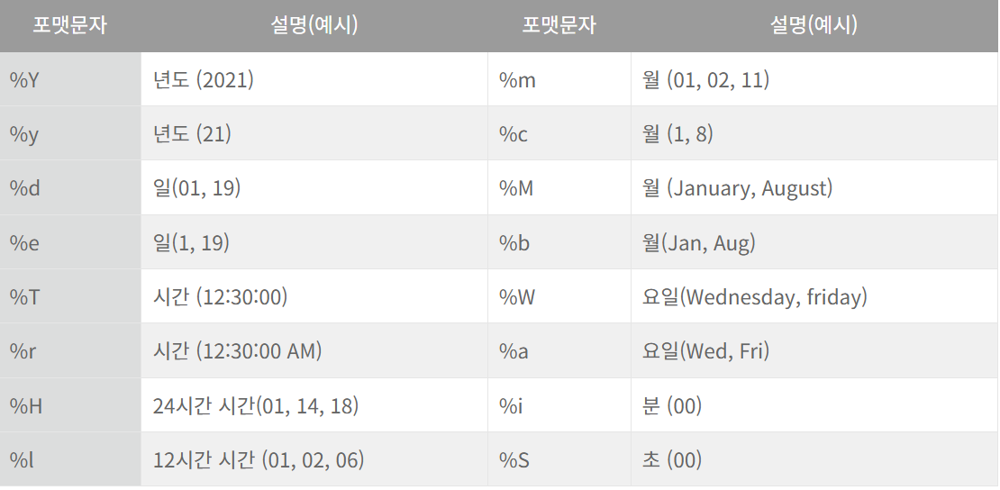
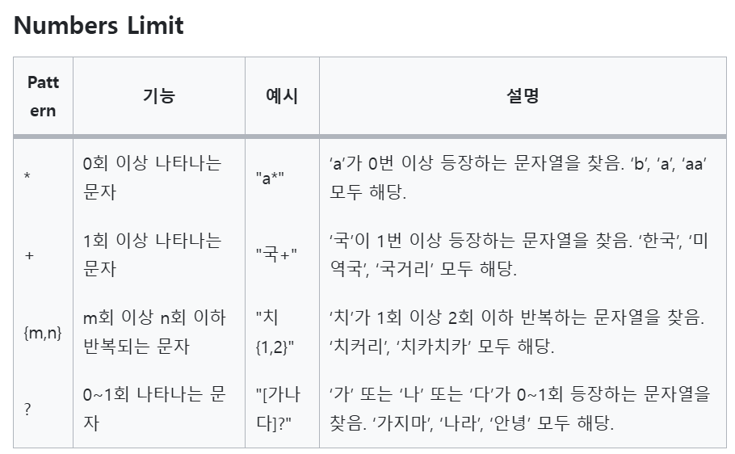

## 1. 
[최솟값 구하기](https://school.programmers.co.kr/learn/courses/30/lessons/59038)

```SQL
SELECT MIN(DATETIME) AS DATETIME
FROM ANIMAL_INS
```
<br/>

## 2.
[동명 동물 수 찾기](https://school.programmers.co.kr/learn/courses/30/lessons/59041)

```SQL
SELECT
    NAME,
    COUNT(NAME) AS COUNT
FROM ANIMAL_INS
GROUP BY NAME
HAVING COUNT(NAME) >= 2
ORDER BY NAME 
```

### 문제 풀이
- WHERE절은 테이블의 각 행에 대해 조건을 확인하고, 조건에 만족하는 행만 남겨놓는 필터링 역할! 
    - 집계함수 못 씀 티비^^ (보통 비교 연산자, 논리 연산자, 문자열 함수, NULL 처리)
    > WHERE절은 **각 행들을 하나씩 비교하고 필터링**함. BUT 집계함수는 **테이블의 여러 행을 그룹화하거나 요약한 결과**이므로 특정 행에 적용 X!! 그러니까 WHERE절은 개별 행을 보는데, 집계함수는 테이블 전체를 요약한 값이기 때문에 비교 자체가 불가능함.
    - WHERE로 필터링한 이후에 필요하다면 GROUP BY나 집계함수 쓰는거임~

- NULL 빼고 집계하기
    - 방법1. WHERE절에 NAME IS NOT NULL
    - 방법2. SELECT문
        - COUNT(컬럼명) : NULL값 제외하고 COUNT
        - COUNT(*) : NULL값 포함해서 전부 COUNT


## 3번
[이름에 el이 들어가는 동물 찾기](https://school.programmers.co.kr/learn/courses/30/lessons/59047)

```SQL
SELECT
    ANIMAL_ID,
    NAME
FROM ANIMAL_INS
WHERE 
    NAME LIKE "%el%"
    AND ANIMAL_TYPE = 'dog'
ORDER BY NAME
```
<br/>


## 4번
[NULL 처리하기](https://school.programmers.co.kr/learn/courses/30/lessons/59410)

```SQL
SELECT
    ANIMAL_TYPE,
    CASE WHEN NAME IS NULL THEN "No name" 
        WHEN NAME IS NOT NULL THEN NAME
        END AS NAME,
    SEX_UPON_INTAKE
FROM ANIMAL_INS
ORDER BY ANIMAL_ID
```

### 문제 풀이
- CASE WHEN 사용법
    1. 새로운 열을 생성하는 경우
    ```SQL
    SELECT CASE WHEN ageband BETWEEN 20 AND 30 THEN '2030'
                WHEN ageband BETWEEN 40 AND 50 THEN '4050'
                ELSE 'other'
                END AS ageband_seg
    ```
    -> ELSE는 생략 가능하긴 하다. 여기서 ELSE 빼고 쓰면 전부 NULL 처리됨

    2. 열을 집계하는 경우 (집계함수와 함께 사용)
    ```SQL
    SELECT gender, ageband,	
	COUNT(CASE WHEN YEAR(join_date) = 2018 THEN mem_no END) AS join_18,
	COUNT(CASE WHEN YEAR(join_date) = 2019 THEN mem_no END) AS join_19
    ```
<br/>

## 5번
[DATETIME에서 DATE로 형 변환](https://school.programmers.co.kr/learn/courses/30/lessons/59414#fn1)


```SQL
SELECT
    ANIMAL_ID,
    NAME,
    DATE_FORMAT(DATETIME, '%Y-%m-%d') AS DATE
FROM ANIMAL_INS
ORDER BY ANIMAL_ID
```

### 문제 풀이
- DATETIME -> DATE 변환
    1. DATE 함수
        - DATETIME에서 날짜 부분만 추출, 단 시간/분/초는 00값을 가짐 (ex. 2025-01-22 00:00:00)
    2. DATE_FORMAT 함수
        - DATETIME에서 ㄹㅇ 날짜만 추출 가능
        - 기본 구조
        ```SQL
        DATE_FORMAT(date, format)
        ```
<br/>

## 6번
[가격이 제일 비싼 식품의 정보 출력하기](https://school.programmers.co.kr/learn/courses/30/lessons/131115)

### 정답 1 
> ORDER BY, LIMIT 쓰는 방법
```SQL
SELECT 
    PRODUCT_ID,
    PRODUCT_NAME,
    PRODUCT_CD,
    CATEGORY,
    PRICE
FROM FOOD_PRODUCT
ORDER BY PRICE DESC
LIMIT 1
```

### 정답 2
> MAX, 서브쿼리 쓰는 방법 
```SQL
SELECT
    PRODUCT_ID,
    PRODUCT_NAME,
    PRODUCT_CD,
    CATEGORY,
    PRICE  
FROM FOOD_PRODUCT
WHERE PRICE = (SELECT MAX(PRICE) FROM FOOD_PRODUCT)
```
WHERE절 : 서브쿼리에서 PRICE의 MAX값을 계산하고, 그 값과 PRICE 개별 행들의 값을 비교해가면서 필터링하는거임! (EX. 서브쿼리에서 계산하기로 PRICE의 MAX값이 100이라면, PRICE 개별 행들을 하나씩 보면서 100을 찾는거임)
<br/>


## 7번
[조건에 맞는 아이템들의 가격의 총합 구하기](https://school.programmers.co.kr/learn/courses/30/lessons/273709)

```SQL
SELECT SUM(PRICE) AS TOTAL_PRICE
FROM ITEM_INFO
WHERE RARITY = 'LEGEND'
```
<br/>

## 8번
[동물 수 구하기](https://school.programmers.co.kr/learn/courses/30/lessons/59406)

```SQL
SELECT COUNT(*) AS count
FROM ANIMAL_INS
```
<br/>

## 9번
[카테고리 별 상품 개수 구하기](https://school.programmers.co.kr/learn/courses/30/lessons/131529)

```SQL
SELECT 
    SUBSTRING(PRODUCT_CODE, 1, 2) AS CATEGORY,
    COUNT(*) AS PRODUCTS
FROM PRODUCT
GROUP BY SUBSTRING(PRODUCT_CODE, 1, 2)
```

<br/>


## 10번

### 정답 1
> DISTINCT 사용
```SQL
SELECT
    COUNT(DISTINCT NAME) AS count   
FROM ANIMAL_INS
WHERE NAME IS NOT NULL;
```

### 정답 2
> GROUP BY 사용
```SQL
SELECT COUNT(*) AS count
FROM (
    SELECT NAME
    FROM ANIMAL_INS
    WHERE NAME IS NOT NULL
    GROUP BY NAME
) AS GROUPED_NAME;
```

- 중복된 값 제거 : DISTINCT OR 서브쿼리에서 GROUP BY 
- NULL값 제거 : COUNT(컬럼명) OR WHERE NAME IS NOT NULL
<br/>
<br/>

------
<br/>
<br/>

## 11번
[진료과별 총 예약 횟수 출력하기](https://school.programmers.co.kr/learn/courses/30/lessons/132202)

```SQL
SELECT
    MCDP_CD AS 진료과코드,
    COUNT(PT_NO) AS 5월예약건수
FROM APPOINTMENT
WHERE DATE_FORMAT(APNT_YMD, '%Y-%m') = '2022-05'
GROUP BY MCDP_CD
ORDER BY 2, 1
```

- 이 문제가 정확히 예약한 고유 환자의 수를 묻는건지 OR 환자 예약 건수를 묻는건지 정확히 모르겠음. (문제 자체적으로는 전자를 묻고 있고, 새로 만드는 컬럼명은 후자를 가리키는 것처럼 보임)
    - 만약 예약한 고유 환자의 수가 궁금하다면 SELECT COUNT(DISTINCT PT_NO)가 더 정확하다! 


## 12번
[고양이와 개는 몇 마리 있을까](https://school.programmers.co.kr/learn/courses/30/lessons/59040)

```SQL
SELECT 
    ANIMAL_TYPE,
    COUNT(ANIMAL_TYPE) AS COUNT
FROM ANIMAL_INS
GROUP BY ANIMAL_TYPE
ORDER BY ANIMAL_TYPE
```

근데 더 정확하게 한다면
```SQL
SELECT ANIMAL_TYPE, COUNT(*) AS COUNT
FROM ANIMAL_INS
WHERE ANIMAL_TYPE IN ('Cat', 'Dog')
GROUP BY ANIMAL_TYPE
ORDER BY FIELD(ANIMAL_TYPE, 'Cat', 'Dog');
```
- ANIMAL_TYPE이 'Cat' 또는 'Dog'인 데이터만 필터링 (WHERE)
- 'Cat'을 'Dog'보다 먼저 정렬 (ORDER BY)


## 13번
[입양 시각 구하기(1)](https://school.programmers.co.kr/learn/courses/30/lessons/59412)
> DATE_FORMAT, HOUR, EXTRACT 중 하나 쓰기
<br/>

### 방법 1 : DATE_FORMAT
```SQL
SELECT
    DATE_FORMAT(DATETIME, '%H') AS HOUR,
    COUNT(ANIMAL_ID) AS COUNT
FROM ANIMAL_OUTS
WHERE DATE_FORMAT(DATETIME, '%H') BETWEEN 09 AND 19
GROUP BY 1
ORDER BY 1
```


<br/>


### 방법 2 : HOUR(컬럼럼)
```SQL
SELECT
    HOUR(DATETIME) AS HOUR,
    COUNT(ANIMAL_ID) AS COUNT
FROM ANIMAL_OUTS
WHERE HOUR(DATETIME) BETWEEN 09 AND 19
GROUP BY HOUR
ORDER BY HOUR
```
<br/>

### 방법 3 : EXTRACT
```SQL
SELECT
    EXTRACT(HOUR FROM DATETIME) AS HOUR,
    COUNT(ANIMAL_ID) AS COUNT
FROM ANIMAL_OUTS
WHERE EXTRACT(HOUR FROM DATETIME) BETWEEN 09 AND 19
GROUP BY HOUR
ORDER BY HOUR
```
<br/>


## 14번
[조건에 맞는 도서와 저자 리스트 출력하기](https://school.programmers.co.kr/learn/courses/30/lessons/144854)

```SQL
SELECT
    BOOK_ID,
    AUTHOR_NAME,
    DATE_FORMAT(PUBLISHED_DATE, '%Y-%m-%d') AS PUBLISHED_DATE
FROM BOOK B
JOIN AUTHOR A
ON B.AUTHOR_ID = A.AUTHOR_ID
WHERE CATEGORY = '경제'
ORDER BY PUBLISHED_DATE;
```

더 효율적으로 코드 쓰고 싶다면 **조건**은 where절로 따로 빼지말고 **on절에 쓰기**!<br/>
JOIN하고 나서 WHERE로 필터링하는 방식이 아니라, **JOIN할 때 조건에 맞는 것만 JOIN하는 것**<br/>
(**ON** B.AUTHOR_ID = A.AUTHOR_ID **AND CATEGORY = '경제'**)<br/>
<br/>


## 15번
[중성화 여부 파악하기](https://school.programmers.co.kr/learn/courses/30/lessons/59409)

```SQL
SELECT
    ANIMAL_ID,
    NAME,
    CASE WHEN SEX_UPON_INTAKE LIKE '%Neutered%' OR '%Spayed%' THEN 'O'
        ELSE 'X' 
        END AS 중성화
FROM ANIMAL_INS
ORDER BY ANIMAL_ID
```
<br/>


## 16번
[상품 별 오프라인 매출 구하기](https://school.programmers.co.kr/learn/courses/30/lessons/131533)

```SQL
SELECT
    PRODUCT_CODE,
    SUM(P.PRICE*O.SALES_AMOUNT) AS SALES
FROM PRODUCT P
JOIN OFFLINE_SALE O
ON P.PRODUCT_ID = O.PRODUCT_ID
GROUP BY PRODUCT_CODE
ORDER BY 2 DESC, 1
```
<br/>

## 17번
[성분으로 구분한 아이스크림 총 주문량](https://school.programmers.co.kr/learn/courses/30/lessons/133026)

```SQL
SELECT
    INGREDIENT_TYPE,
    SUM(TOTAL_ORDER) AS TOTAL_ORDER
FROM FIRST_HALF F
JOIN ICECREAM_INFO I
ON F.FLAVOR = I.FLAVOR
GROUP BY INGREDIENT_TYPE
ORDER BY 2
```
<br/>


## 18번
[3월에 태어난 여성 회원 목록 출력하기](https://school.programmers.co.kr/learn/courses/30/lessons/131120)

```SQL
SELECT
    MEMBER_ID,
    MEMBER_NAME,
    GENDER,
    DATE_FORMAT(DATE_OF_BIRTH, '%Y-%m-%d') AS DATE_OF_BIRTH
FROM MEMBER_PROFILE
WHERE DATE_FORMAT(DATE_OF_BIRTH, '%m') = '03'
    AND GENDER = 'W'
    AND TLNO IS NOT NULL
ORDER BY MEMBER_ID 
```

EXTRACT는 연,월,일,시간 등 일부만 필요할 때 쓰는게 가장 효율적이다..^_^
<br/>

## 19번
[루시와 엘라 찾기](https://school.programmers.co.kr/learn/courses/30/lessons/59046)

```SQL
SELECT
    ANIMAL_ID,
    NAME,
    SEX_UPON_INTAKE
FROM ANIMAL_INS
WHERE NAME IN ('Lucy', 'Ella', 'Pickle', 'Rogan', 'Sabrina', 'Mitty')
```
<br/>

## 20번
[오랜 기간 보호한 동물(1)](https://school.programmers.co.kr/learn/courses/30/lessons/59044)

```SQL
SELECT
    I.NAME,
    I.DATETIME
FROM ANIMAL_INS I
LEFT JOIN ANIMAL_OUTS O
ON I.ANIMAL_ID = O.ANIMAL_ID
WHERE O.ANIMAL_ID IS NULL
ORDER BY DATETIME  
LIMIT 3;
```

> 🐹 서브쿼리 안 쓰고 OUTER JOIN으로만 풀어보기! <br/>
    참고로 해당 코드는 DATETIME이 동일한 경우는 고려하지 않은 코드임 (문제에서 딱히 명시하지 않았으니까..ㅎㅅㅎ)


<br/>
<br/>

------
<br/>
<br/>

## 정규표현식 REGEXP
- 특정한 **규칙**을 가진 문자열의 집합을 표현할 때 사용하는 언어

- 쉽게 말해서, **PATTERN**과 일치하는 문자열을 찾아 **문자열을 처리하는 방법 중 하나**로 복잡한 문자열 조건을 걸어 데이터 검색 가능!





> 🐹복잡한 문자열 조건일수록 확실히 LIKE보다 효율적!

<br/>
<br/>

### 예제 1.
'길' 또는 '로" 또는 '그'가 포함된 문자열을 찾고 싶을 때
- 정규표현식을 사용하지 않을 때
```SQL
SELECT *
FROM tbl
WHERE data like '%길%'
OR data like '%로%'
OR data like '%그%'
```

- 정규표현식을 사용할 때
```SQL
SELECT *
FROM tbl
WHERE data REGEXP '길|로|그'
```


### 예제 2.
길이 7글자인 문자열 중 2번째 자리부터 abc를 포함하는 문자열을 찾고 싶을 때

- 정규표현식을 사용하지 않을 때
```SQL
SELECT *
FROM tbl
WHERE CHAR_LENGTH(data) = 7 AND SUBSTRING(data, 2, 3) = 'abc';
```


- 정규표현식을 사용할 때
```SQL
SELECT *
FROM tbl
WHERE data REGEXP ('^.abc...$');
```
<br/>
<br/>
[참고링크](https://velog.io/@gillog/MySQL-REGEXPRegular-Expression%EC%A0%95%EA%B7%9C-%ED%91%9C%ED%98%84%EC%8B%9D)
<br/>

----
<br/>
<br/>

### 비트연산자
이게뭐지...

- 비트 : 0 또는 1의 값을 가질 수 있는 단위
- 비트 한칸한칸씩 비교하는 연산자
- MySQL에서는 '0'과 '1'로만 이루어진 문자열 앞에 'b'를 붙여 2진수를 표현할 수 있음


