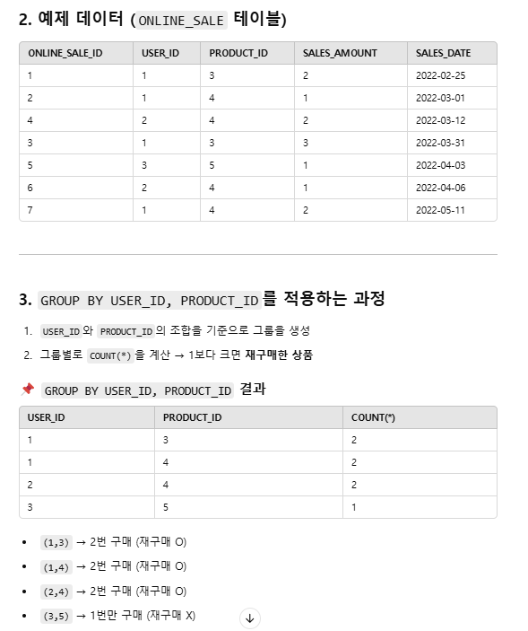

### 1번
[가격대 별 상품 개수 구하기](https://school.programmers.co.kr/learn/courses/30/lessons/131530)


```SQL
SELECT
    FLOOR(PRICE/10000)*10000 AS PRICE_GROUP,
    COUNT(PRODUCT_ID) AS PRODUCTS
FROM PRODUCT
GROUP BY PRICE_GROUP
ORDER BY PRICE_GROUP
```


## 2번 ⭐
[연도 별 평균 미세먼지 농도 조회하기](https://school.programmers.co.kr/learn/courses/30/lessons/284530)

```SQL
SELECT
    YEAR(YM) AS "YEAR",
    ROUND(AVG(PM_VAL1), 2) AS "PM10", 
    ROUND(AVG(PM_VAL2), 2) AS "PM2.5" 
FROM AIR_POLLUTION
WHERE LOCATION2 = '수원'
GROUP BY YEAR(YM)
ORDER BY 1;
```
<br/>

> DATE_FORMAT VS YEAR <br/>

DATE_FORMAT 쓰면 오류 난다 .. <br/>
출력값은 같아보여도 DATE_FORMAT은 문자열 타입, YEAR은 정수형 타입.<br/>
특정 MySQL 설정에서는 문자열 정렬 방식이 다를 수 있어 GROUP BY에서 오류가 날수도.<br/> 단순히 결과를 출력할 때는 DATE_FORMAT을 써도 되지만, **정렬을 해야한다면 YEAR을 써야 오류 가능성 없이 동작 가능**!

<br/>


> 반올림 함수 ROUND 사용법
- ROUND(숫자, 숫자를 반올림할 자릿수-1)
- 자릿수 안 적으면 알아서 소수점 첫번째에서 반올림

<BR/>

> 버림 함수 TRUNCATE
- TRUNCATE(숫자, 버림할 자릿수)
- 버림할 자릿수 안 적으면 작동 x <br/>
ex.
```SQL
SELECT TRUNCATE(1234.56789 ,1) FROM DUAL;
-- 1234.5
```


## 3번 ⭐⭐
[물고기 종류 별 잡은 수 구하기](https://school.programmers.co.kr/learn/courses/30/lessons/293257)

```SQL
SELECT   
    COUNT(F.ID) AS FISH_COUNT,
    N.FISH_NAME AS FISH_NAME
FROM FISH_INFO F
JOIN FISH_NAME_INFO N 
    ON F.FISH_TYPE = N.FISH_TYPE
GROUP BY N.FISH_TYPE, N.FISH_NAME 
ORDER BY FISH_COUNT DESC;
```

> GROUP BY에 컬럼 2개 이상 처음 써봄.. 신기하다..<BR/>
참고로 GROUP BY A, B -> **A 다음 B 순서로 그룹을 나누는게 아니라 A와 B의 모든 고유 조합을 그룹으로 만드는 것** 🤠

<BR/>


> 🐹 GROUP BY 규칙!
<BR/>
- GROUP BY에 포함된 컬럼이 아니면 SELECT에서 직접 쓸 수 없다
- GROUP BY에 포함된 컬럼 중 **일부만 SELECT에 쓰면 된다** (꼭 전부를 쓸 필요는 X)


## 4번 ⭐⭐
[ROOT 아이템 구하기](https://school.programmers.co.kr/learn/courses/30/lessons/273710)


### 방법 1 : JOIN
```SQL
SELECT
    I.ITEM_ID AS ITEM_ID,
    I.ITEM_NAME AS ITEM_NAME
FROM ITEM_INFO I
JOIN ITEM_TREE T
ON I.ITEM_ID = T.ITEM_ID
WHERE T.PARENT_ITEM_ID IS NULL
ORDER BY I.ITEM_ID ASC;
```


### 방법 2 : 서브쿼리
```SQL
SELECT
    ITEM_ID,
    ITEM_NAME 
FROM ITEM_INFO
WHERE ITEM_ID IN (
    SELECT ITEM_ID
    FROM ITEM_TREE
    WHERE PARENT_ITEM_ID IS NULL)
ORDER BY ITEM_ID ASC;
```
야호~ 서브쿼리 썼다


## 5번
[월별 잡은 물고기 수 구하기](https://school.programmers.co.kr/learn/courses/30/lessons/293260)

```SQL
SELECT
    COUNT(ID) AS FISH_COUNT,
    MONTH(TIME) AS MONTH
FROM FISH_INFO
GROUP BY MONTH(TIME)
HAVING COUNT(ID) > 0
ORDER BY 2 ASC;
```


## 6번 ⭐⭐ - 쿼리 작동 순서
[조건에 맞는 사원 정보 조회하기](https://school.programmers.co.kr/learn/courses/30/lessons/284527)

### 방법 1 : LIMIT
```SQL
SELECT
    G.SCORE,
    E.EMP_NO,
    E.EMP_NAME,
    E.POSITION,
    E.EMAIL
FROM HR_EMPLOYEES E
JOIN (SELECT EMP_NO, SUM(SCORE) AS SCORE
      FROM HR_GRADE
      GROUP BY EMP_NO
      ORDER BY SCORE DESC
      LIMIT 1
     ) G ON E.EMP_NO = G.EMP_NO 
```
> 이 경우, MAX를 쓸 수 X <BR/>
서브쿼리절 WHERE에서 SCORE랑 MAX(SCORE) 비교해서 SCORE MAX인 것만 필터링하게 하면 상반기든 하반기든 가장 높은 점수 1개만 가져오니까..<BR/>
우리가 궁금한건 상반기+하반기 했을 때 가장 높은 점수를 가지는 사원임 !

<br/>


### 방법2 : MAX()
```SQL
SELECT
    G.SCORE,
    E.EMP_NO,
    E.EMP_NAME,
    E.POSITION,
    E.EMAIL
FROM HR_EMPLOYEES E
JOIN (SELECT EMP_NO, SUM(SCORE) AS SCORE
      FROM HR_GRADE
      GROUP BY EMP_NO) G ON E.EMP_NO = G.EMP_NO
WHERE G.SCORE = (
    SELECT MAX(SUM_SCORE)
    FROM (
        SELECT EMP_NO, SUM(SCORE) AS SUM_SCORE
        FROM HR_GRADE
        GROUP BY EMP_NO
    ) S
);
```
> 방법1 순서대로 한다면 MAX를 쓸 수 없지만, 방법2처럼 하면 MAX 쓸 수 있음! <BR/>
어려운 쿼리는 아닌데 머리가 아프다 그래도 해냄 ^_^ v

<br/>


## 7번 ⭐⭐
[재구매가 일어난 상품과 회원 리스트 구하기](https://school.programmers.co.kr/learn/courses/30/lessons/131536)

```SQL
SELECT USER_ID, PRODUCT_ID
FROM ONLINE_SALE
GROUP BY USER_ID, PRODUCT_ID
HAVING COUNT(*) >= 2
ORDER BY USER_ID, PRODUCT_ID DESC;
```

> GROUP BY에서 컬럼 2개 이상 오면 뭐다? 순서대로 그룹화 아니고 **조합**이다~

