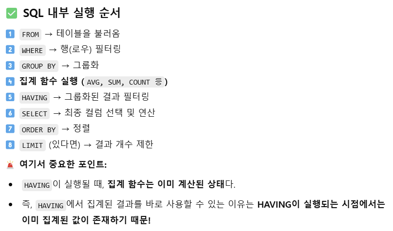

### 1번
[가격대 별 상품 개수 구하기](https://school.programmers.co.kr/learn/courses/30/lessons/131530)


```SQL
SELECT
    FLOOR(PRICE/10000)*10000 AS PRICE_GROUP,
    COUNT(PRODUCT_ID) AS PRODUCTS
FROM PRODUCT
GROUP BY PRICE_GROUP
ORDER BY PRICE_GROUP
```


## 2번 ⭐
[연도 별 평균 미세먼지 농도 조회하기](https://school.programmers.co.kr/learn/courses/30/lessons/284530)

```SQL
SELECT
    YEAR(YM) AS "YEAR",
    ROUND(AVG(PM_VAL1), 2) AS "PM10", 
    ROUND(AVG(PM_VAL2), 2) AS "PM2.5" 
FROM AIR_POLLUTION
WHERE LOCATION2 = '수원'
GROUP BY YEAR(YM)
ORDER BY 1;
```
<br/>

> DATE_FORMAT VS YEAR <br/>

DATE_FORMAT 쓰면 오류 난다 .. <br/>
출력값은 같아보여도 DATE_FORMAT은 문자열 타입, YEAR은 정수형 타입.<br/>
특정 MySQL 설정에서는 문자열 정렬 방식이 다를 수 있어 GROUP BY에서 오류가 날수도.<br/> 단순히 결과를 출력할 때는 DATE_FORMAT을 써도 되지만, **정렬을 해야한다면 YEAR을 써야 오류 가능성 없이 동작 가능**!

<br/>


> 반올림 함수 ROUND 사용법
- ROUND(숫자, 숫자를 반올림할 자릿수-1)
- 자릿수 안 적으면 알아서 소수점 첫번째에서 반올림

<BR/>

> 버림 함수 TRUNCATE
- TRUNCATE(숫자, 버림할 자릿수)
- 버림할 자릿수 안 적으면 작동 x <br/>
ex.
```SQL
SELECT TRUNCATE(1234.56789 ,1) FROM DUAL;
-- 1234.5
```


## 3번 ⭐⭐
[물고기 종류 별 잡은 수 구하기](https://school.programmers.co.kr/learn/courses/30/lessons/293257)

```SQL
SELECT   
    COUNT(F.ID) AS FISH_COUNT,
    N.FISH_NAME AS FISH_NAME
FROM FISH_INFO F
JOIN FISH_NAME_INFO N 
    ON F.FISH_TYPE = N.FISH_TYPE
GROUP BY N.FISH_TYPE, N.FISH_NAME 
ORDER BY FISH_COUNT DESC;
```

> GROUP BY에 컬럼 2개 이상 처음 써봄.. 신기하다..<BR/>
참고로 GROUP BY A, B -> **A 다음 B 순서로 그룹을 나누는게 아니라 A와 B의 모든 고유 조합을 그룹으로 만드는 것** 🤠

<BR/>


> 🐹 GROUP BY 규칙!
<BR/>
- GROUP BY에 포함된 컬럼이 아니면 SELECT에서 직접 쓸 수 없다
- GROUP BY에 포함된 컬럼 중 **일부만 SELECT에 쓰면 된다** (꼭 전부를 쓸 필요는 X)

<br/>

## 4번 ⭐⭐
[ROOT 아이템 구하기](https://school.programmers.co.kr/learn/courses/30/lessons/273710)


### 방법 1 : JOIN
```SQL
SELECT
    I.ITEM_ID AS ITEM_ID,
    I.ITEM_NAME AS ITEM_NAME
FROM ITEM_INFO I
JOIN ITEM_TREE T
ON I.ITEM_ID = T.ITEM_ID
WHERE T.PARENT_ITEM_ID IS NULL
ORDER BY I.ITEM_ID ASC;
```


### 방법 2 : 서브쿼리
```SQL
SELECT
    ITEM_ID,
    ITEM_NAME 
FROM ITEM_INFO
WHERE ITEM_ID IN (
    SELECT ITEM_ID
    FROM ITEM_TREE
    WHERE PARENT_ITEM_ID IS NULL)
ORDER BY ITEM_ID ASC;
```
야호~ 서브쿼리 썼다

<br/>

## 5번
[월별 잡은 물고기 수 구하기](https://school.programmers.co.kr/learn/courses/30/lessons/293260)

```SQL
SELECT
    COUNT(ID) AS FISH_COUNT,
    MONTH(TIME) AS MONTH
FROM FISH_INFO
GROUP BY MONTH(TIME)
HAVING COUNT(ID) > 0
ORDER BY 2 ASC;
```
<br/>

## 6번 ⭐⭐ - 쿼리 작동 순서
[조건에 맞는 사원 정보 조회하기](https://school.programmers.co.kr/learn/courses/30/lessons/284527)

### 방법 1 : LIMIT
```SQL
SELECT
    G.SCORE,
    E.EMP_NO,
    E.EMP_NAME,
    E.POSITION,
    E.EMAIL
FROM HR_EMPLOYEES E
JOIN (SELECT EMP_NO, SUM(SCORE) AS SCORE
      FROM HR_GRADE
      GROUP BY EMP_NO
      ORDER BY SCORE DESC
      LIMIT 1
     ) G ON E.EMP_NO = G.EMP_NO 
```
> 이 경우, MAX를 쓸 수 X <BR/>
서브쿼리절 WHERE에서 SCORE랑 MAX(SCORE) 비교해서 SCORE MAX인 것만 필터링하게 하면 상반기든 하반기든 가장 높은 점수 1개만 가져오니까..<BR/>
우리가 궁금한건 상반기+하반기 했을 때 가장 높은 점수를 가지는 사원임 !

<br/>


### 방법2 : MAX()
```SQL
SELECT
    G.SCORE,
    E.EMP_NO,
    E.EMP_NAME,
    E.POSITION,
    E.EMAIL
FROM HR_EMPLOYEES E
JOIN (SELECT EMP_NO, SUM(SCORE) AS SCORE
      FROM HR_GRADE
      GROUP BY EMP_NO) G ON E.EMP_NO = G.EMP_NO
WHERE G.SCORE = (
    SELECT MAX(SUM_SCORE)
    FROM (
        SELECT EMP_NO, SUM(SCORE) AS SUM_SCORE
        FROM HR_GRADE
        GROUP BY EMP_NO
    ) S
);
```
> 방법1 순서대로 한다면 MAX를 쓸 수 없지만, 방법2처럼 하면 MAX 쓸 수 있음! <BR/>
어려운 쿼리는 아닌데 머리가 아프다 그래도 해냄 ^_^ v

<br/>


## 7번 ⭐⭐
[재구매가 일어난 상품과 회원 리스트 구하기](https://school.programmers.co.kr/learn/courses/30/lessons/131536)

```SQL
SELECT USER_ID, PRODUCT_ID
FROM ONLINE_SALE
GROUP BY USER_ID, PRODUCT_ID
HAVING COUNT(*) >= 2
ORDER BY USER_ID, PRODUCT_ID DESC;
```

> GROUP BY에서 컬럼 2개 이상 오면 뭐다? 순서대로 그룹화 아니고 **조합**이다~


<br/>

## 8번
[특정 물고기를 잡은 총 수 구하기](https://school.programmers.co.kr/learn/courses/30/lessons/298518)

```SQL
SELECT COUNT(*) AS "FISH_COUNT"
FROM FISH_INFO
WHERE FISH_TYPE IN (
    SELECT FISH_TYPE
    FROM FISH_NAME_INFO
    WHERE FISH_NAME IN ("BASS", "SNAPPER")
    )
```


## 9번
[자동차 평균 대여 기간 구하기](https://school.programmers.co.kr/learn/courses/30/lessons/157342)

```SQL
SELECT 
    CAR_ID, 
    ROUND(AVG(DATEDIFF(END_DATE, START_DATE) + 1), 1) AS "AVERAGE_DURATION"
FROM CAR_RENTAL_COMPANY_RENTAL_HISTORY
GROUP BY CAR_ID
HAVING AVERAGE_DURATION >= 7
ORDER BY AVERAGE_DURATION DESC, CAR_ID DESC;
```

- DATEDIFF(종료일, 시작일) 함수
    - 날짜 포맷에 시간이 포함되어 있는 경우, 시간은 계산에 포함하지 않음
    - 기간 차이만 반환 (첫날 포함 X) -> 그래서 첫날부터 마지막날까지 알려면 +1해야됨~   


- **HAVING에서 바로 별칭 쓰는거 MySQL에서는 가능!** <BR/>
집계함수가 HAVING보다 먼저 계산되기 때문 .. ^_^



<BR/>


## 10번
[노선별 평균 역 사이 거리 조회하기](https://school.programmers.co.kr/learn/courses/30/lessons/284531)


```SQL
SELECT
    ROUTE,
    CONCAT(ROUND(SUM(D_BETWEEN_DIST), 1), 'km') AS TOTAL_DISTANCE, 
    CONCAT(ROUND(AVG(D_BETWEEN_DIST), 2), 'km') AS AVERAGE_DISTANCE
FROM SUBWAY_DISTANCE
GROUP BY ROUTE
ORDER BY ROUND(SUM(D_BETWEEN_DIST), 1) DESC;
```

> ORDER BY 쓸 때 웬만하면 1,2보다는 별칭 또는 계산식대로 쓰기!<br/>
이 문제 같은 경우, ORDER BY 2라고만 쓰게 되면 문자열을 기준으로 내림차순 정렬 시도를 하므로 오류 날 가능성이 높다.<br/>
CONCAT 함수 적용 전인 ROUND..까지만 가져와야~~

<br/>

## 11번
[분기별 분화된 대장균의 개체 수 구하기](https://school.programmers.co.kr/learn/courses/30/lessons/299308)

### 방법 1
```SQL
SELECT
    E.QUARTER,
    COUNT(ID) AS ECOLI_COUNT
FROM (
    SELECT ID,
    CONCAT(QUARTER(DIFFERENTIATION_DATE), "Q") AS QUARTER
    FROM ECOLI_DATA
) E
GROUP BY E.QUARTER
ORDER BY E.QUARTER;
```
<br/>

### 🤔🤔🤔 왜 않되...
```SQL
SELECT
    CONCAT(QUARTER(DIFFERENTIATION_DATE), 'Q') AS QUARTER,
    COUNT(ID) AS ECOLI_COUNT
FROM ECOLI_DATA
WHERE PARENT_ID IS NOT NULL
GROUP BY QUARTER(DIFFERENTIATION_DATE)
ORDER BY QUARTER(DIFFERENTIATION_DATE);
```
-> 이 코드는 왜 안되는걸까요..?

<br/>

## 12번
[업그레이드 된 아이템 구하기](https://school.programmers.co.kr/learn/courses/30/lessons/273711)

```SQL
SELECT
    P.ITEM_ID AS "ITEM_ID",
    I.ITEM_NAME AS "ITEM_NAME",
    I.RARITY AS "RARITY"  
FROM ITEM_INFO I
JOIN ITEM_TREE P
ON I.ITEM_ID = P.ITEM_ID
WHERE P.PARENT_ITEM_ID IN (
    SELECT ITEM_ID
    FROM ITEM_INFO
    WHERE RARITY = 'RARE'
    )   
ORDER BY P.ITEM_ID DESC;
```

> I.ITEM_ID가 P.PARENT_ITEM_ID인 P.ITEM_ID가 바로 문제에서 찾는 다음 업그레이드 아이템!<BR/>
서브쿼리 써서 WHERE절에서 비교하며 필터링하면 된다~ JOIN은 필수!


<br/>


## 13번
[연도별 대장균 크기의 편차 구하기](https://school.programmers.co.kr/learn/courses/30/lessons/299310)

```SQL
SELECT 
    YEAR(DIFFERENTIATION_DATE) AS YEAR,
    MAX(SIZE_OF_COLONY) OVER (PARTITION BY YEAR(DIFFERENTIATION_DATE)) - SIZE_OF_COLONY AS YEAR_DEV,
    ID
FROM ECOLI_DATA
ORDER BY YEAR, YEAR_DEV;
```

<br/>

## 14번
[부모의 형질을 모두 가지는 대장균 찾기](https://school.programmers.co.kr/learn/courses/30/lessons/301647)

```SQL
SELECT 
    E1.ID, 
    E1.GENOTYPE, 
    E2.GENOTYPE AS PARENT_GENOTYPE
FROM ECOLI_DATA E1
JOIN ECOLI_DATA E2 ON E1.PARENT_ID = E2.ID
WHERE (E1.GENOTYPE & E2.GENOTYPE) = E2.GENOTYPE
ORDER BY E1.ID;
```

> 부모가 가진 형질을 자식이 모두 가지고 있어야 하므로 비트 AND 연산 써서 ```자식 & 부모 = 부모```가 성립되는지 체크하면 된다!

<br/>

## 15번
[자동차 대여 기록에서 장기/단기 대여 구분하기](https://school.programmers.co.kr/learn/courses/30/lessons/151138)

```SQL
SELECT
    HISTORY_ID,
    CAR_ID,
    DATE_FORMAT(START_DATE, "%Y-%m-%d") AS "START_DATE",
    DATE_FORMAT(END_DATE, "%Y-%m-%d") AS "END_DATE", 
    CASE WHEN DATEDIFF(END_DATE, START_DATE)+ 1 >= 30 THEN  "장기 대여"
        ELSE "단기 대여" END AS "RENT_TYPE"
FROM CAR_RENTAL_COMPANY_RENTAL_HISTORY
WHERE DATE_FORMAT(START_DATE, "%Y-%m") = "2022-09"
ORDER BY HISTORY_ID DESC;

```

## 16번
[조건에 부합하는 중고거래 댓글 조회하기](https://school.programmers.co.kr/learn/courses/30/lessons/164673)

```SQL
SELECT
    B.TITLE,
    B.BOARD_ID,
    R.REPLY_ID,
    R.WRITER_ID,
    R.CONTENTS,
    DATE_FORMAT(R.CREATED_DATE, "%Y-%m-%d") AS "CREATED_DATE"
FROM USED_GOODS_BOARD B
JOIN USED_GOODS_REPLY R
ON B.BOARD_ID = R.BOARD_ID
WHERE DATE_FORMAT(B.CREATED_DATE, "%Y-%m") = "2022-10"
ORDER BY R.CREATED_DATE, B.TITLE;
```
<br/>
<br/>
<br/>
<br/>
<br/>


<BR/>

# Level 3

## 17번
[있었는데요 없었습니다](https://school.programmers.co.kr/learn/courses/30/lessons/59043)

### 방법 1 : 두 날짜를 부등호로 비교 
```SQL
SELECT I.ANIMAL_ID, I.NAME
FROM ANIMAL_INS I
JOIN ANIMAL_OUTS O ON I.ANIMAL_ID = O.ANIMAL_ID
WHERE O.DATETIME < I.DATETIME
ORDER BY I.DATETIME;
```

### 방법 2 : TIMEDIFF가 음수인 경우
```SQL
SELECT
    I.ANIMAL_ID,
    I.NAME
FROM ANIMAL_INS I
JOIN ANIMAL_OUTS O
ON I.ANIMAL_ID = O.ANIMAL_ID
WHERE DATEDIFF(O.DATETIME, I.DATETIME) < 0
ORDER BY I.DATETIME;
```
> 쉬운 방법 두고 DATEDIFF 쓰고 있었다..ㄱ- <BR/>
TIMEDIFF는 음수값도 반환되니까!!

<BR/>


## 18번
[부서별 평균 연봉 조회하기](https://school.programmers.co.kr/learn/courses/30/lessons/284529)

```SQL
SELECT
    E.DEPT_ID,
    D.DEPT_NAME_EN,
    ROUND(AVG(E.SAL)) AS AVG_SAL
FROM HR_DEPARTMENT D
JOIN HR_EMPLOYEES E
ON D.DEPT_ID = E.DEPT_ID
GROUP BY E.DEPT_ID
ORDER BY 3 DESC;
```

## 19번
[조건별로 분류하여 주문상태 출력하기](https://school.programmers.co.kr/learn/courses/30/lessons/131113)

```SQL
SELECT
    ORDER_ID,
    PRODUCT_ID,
    DATE_FORMAT(OUT_DATE, '%Y-%m-%d') AS "OUT_DATE",
    CASE WHEN OUT_DATE <= '2022-05-01' THEN "출고완료"
        WHEN OUT_DATE > '2022-05-01' THEN "출고대기"
        ELSE "출고미정" END AS "출고여부"
FROM FOOD_ORDER
ORDER BY ORDER_ID;
```

<br/>

## 20번
[조회수가 가장 많은 중고거래 게시판의 첨부파일 조회하기](https://school.programmers.co.kr/learn/courses/30/lessons/164671)

### 방법 1 : JOIN할 때 테이블에서 최대 조회수랑 JOIN KEY만 가지고 오기
```SQL
SELECT
    CONCAT('/home/grep/src/', V.BOARD_ID, '/', F.FILE_ID, F.FILE_NAME, F.FILE_EXT) AS "FILE_PATH"
FROM USED_GOODS_FILE F
JOIN (SELECT BOARD_ID, VIEWS
     FROM USED_GOODS_BOARD
     ORDER BY VIEWS DESC
     LIMIT 1) V ON V.BOARD_ID = F.BOARD_ID
ORDER BY F.FILE_ID DESC;
```
> 조회수가 가장 높은 게시물은 1개라고 했으니까 LIMIT 1 써도 됨! <BR/>
하지만 2개 이상일 가능성이 있다면 MAX를 써야 2개 다 가지고 온다. <BR/> 
조회수 가장 높은 게시물이 2개 이상인데 LIMIT 1 쓰면 임의로 1개만 가지고 옴..

<BR/>

### 방법 2 : WHERE에서 비교해가며 최대 조회수 게시물 필터링하기
```SQL
SELECT 
    CONCAT('/home/grep/src/', B.BOARD_ID, '/', F.FILE_ID, F.FILE_NAME, F.FILE_EXT) AS FILE_PATH
FROM USED_GOODS_FILE F
JOIN USED_GOODS_BOARD B 
    ON F.BOARD_ID = B.BOARD_ID
WHERE B.VIEWS = (SELECT MAX(VIEWS) FROM USED_GOODS_BOARD)
ORDER BY F.FILE_ID DESC;
```