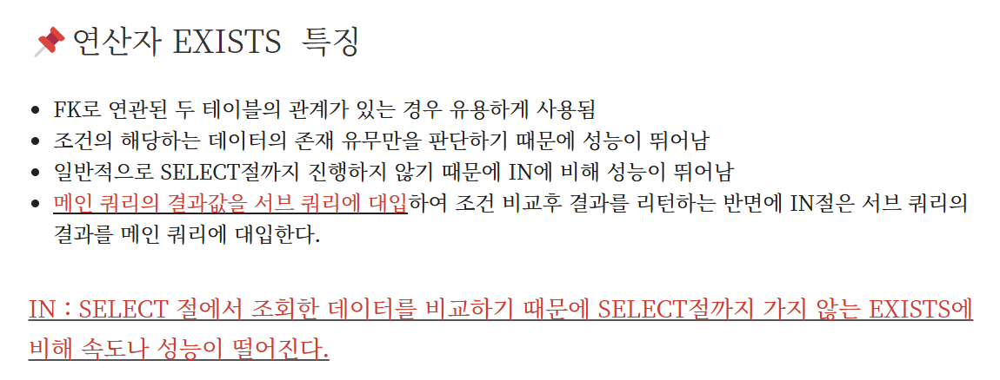
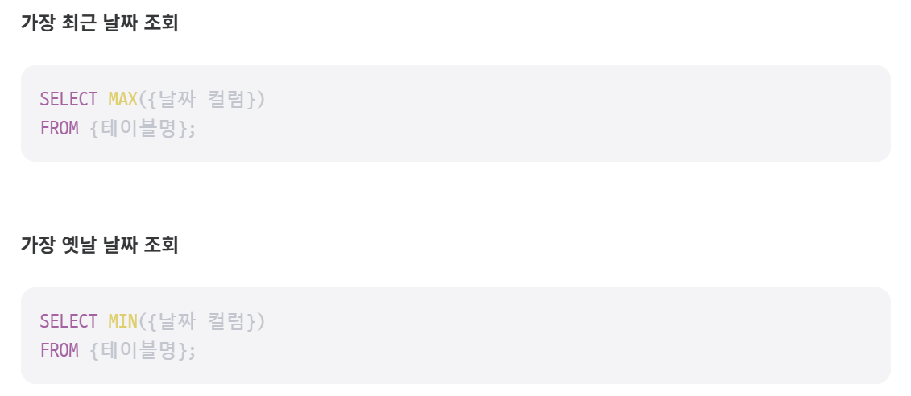
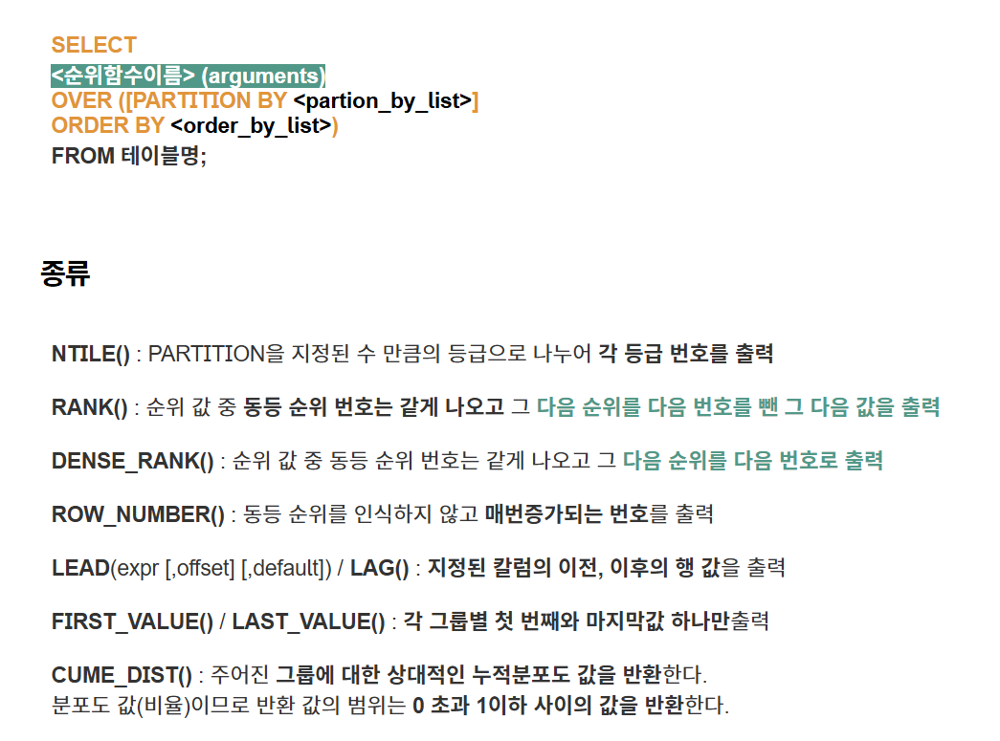

## 1번.
[카테고리 별 도서 판매량 집계하기](https://school.programmers.co.kr/learn/courses/30/lessons/144855)

```SQL
SELECT
    B.CATEGORY,
    SUM(S.SALES) AS "TOTAL_SALES"
FROM BOOK B
JOIN BOOK_SALES S
ON B.BOOK_ID = S.BOOK_ID AND DATE_FORMAT(SALES_DATE, '%Y-%m') = '2022-01'
GROUP BY B.CATEGORY
ORDER BY B.CATEGORY ASC;
```


## 2번.
[오랜 기간 보호한 동물(2)](https://school.programmers.co.kr/learn/courses/30/lessons/59411)


### 정답 1
```SQL
SELECT O.ANIMAL_ID, O.NAME
FROM ANIMAL_INS I
JOIN ANIMAL_OUTS O
ON I.ANIMAL_ID = O.ANIMAL_ID
ORDER BY (DATEDIFF(O.DATETIME, I.DATETIME) + 1) DESC
LIMIT 2;
```

### 정답 2
```SQL
SELECT
    (DATEDIFF(O.DATETIME, I.DATETIME) + 1) AS PERIOD,
    O.ANIMAL_ID,
    O.NAME
FROM ANIMAL_INS I
JOIN ANIMAL_OUTS O
ON I.ANIMAL_ID = O.ANIMAL_ID
GROUP BY (DATEDIFF(O.DATETIME, I.DATETIME) + 1)
ORDER BY (DATEDIFF(O.DATETIME, I.DATETIME) + 1) DESC
LIMIT 2;
```


## 3번.
[대여 기록이 존재하는 자동차 리스트 구하기](https://school.programmers.co.kr/learn/courses/30/lessons/157341)


```SQL
SELECT C.CAR_ID
FROM CAR_RENTAL_COMPANY_CAR C
JOIN CAR_RENTAL_COMPANY_RENTAL_HISTORY R
ON C.CAR_ID=R.CAR_ID AND C.CAR_TYPE = '세단'
WHERE MONTH(R.START_DATE) = '10'
GROUP BY C.CAR_ID
ORDER BY C.CAR_ID DESC;
```
> 중복 제거를 위해 GROUP BY 안하고 DISTINCT 쓰는 것도 가능!


## 4번
[즐겨찾기가 가장 많은 식당 정보 출력하기](https://school.programmers.co.kr/learn/courses/30/lessons/131123)

> GROUP BY를 쓸 수 없는 상황임!<BR/> 
FOOD_TYPE으로 그룹화해야되는데, SELECT에서 반환해야되는 다른 컬럼들이 있으니까...<BR/>
GROUP BY를 쓸거면 
> 1. SELECT에 쓴 컬럼들이 모두 GROUP BY 안에 있거나, 2. 집계함수를 사용해야하는데 ('GROUP BY 컬럼'이라면 그 컬럼을 기준으로 그룹화를 할텐데, GROUP BY에 쓰이지 않는 컬럼들은 뭘 기준으로 해야될지 SQL은 알 수 없으므로...)

<BR/>


### 정답 1 : 서브쿼리
```SQL
SELECT FOOD_TYPE, REST_ID, REST_NAME, FAVORITES
FROM REST_INFO AS R1
WHERE FAVORITES = (
    SELECT MAX(FAVORITES) 
    FROM REST_INFO AS R2 
    WHERE R1.FOOD_TYPE = R2.FOOD_TYPE
)
ORDER BY FOOD_TYPE DESC;
```

### 정답 2: 윈도우 함수
```SQL
SELECT FOOD_TYPE, REST_ID, REST_NAME, FAVORITES
FROM (
    SELECT FOOD_TYPE, REST_ID, REST_NAME, FAVORITES,
           RANK() OVER (PARTITION BY FOOD_TYPE ORDER BY FAVORITES DESC) AS rnk
    FROM REST_INFO
) sub
WHERE rnk = 1
ORDER BY FOOD_TYPE DESC;
```

- RANK() OVER (PARTITION BY FOOD_TYPE ORDER BY FAVORITES DESC)
    - 같은 FOOD_TYPE 내에서 FAVORITES가 가장 많은 식당을 찾음
- WHERE rnk = 1
    - 가장 즐겨찾기 수가 높은 식당만 선택


## 5번
[조건에 맞는 사용자와 총 거래금액 조회하기](https://school.programmers.co.kr/learn/courses/30/lessons/164668)

```SQL
SELECT
    U.USER_ID,
    NICKNAME,
    SUM(PRICE) AS TOTAL_SALES
FROM USED_GOODS_BOARD B
JOIN USED_GOODS_USER U
ON B.WRITER_ID = U.USER_ID AND STATUS = 'DONE'
GROUP BY U.USER_ID, U.NICKNAME
HAVING SUM(PRICE) >= 700000
ORDER BY TOTAL_SALES ASC;
```


## 6번
[없어진 기록 찾기](https://school.programmers.co.kr/learn/courses/30/lessons/59042)

### 정답 1 : RIGHT JOIN
```SQL
SELECT O.ANIMAL_ID, O.NAME
FROM ANIMAL_INS I
RIGHT OUTER JOIN ANIMAL_OUTS O
ON I.ANIMAL_ID = O.ANIMAL_ID
WHERE I.ANIMAL_ID IS NULL 
ORDER BY O.ANIMAL_ID ASC;
```


### 정답 2 : NOT EXISTS
```SQL
SELECT O.ANIMAL_ID, O.NAME
FROM ANIMAL_OUTS O
WHERE NOT EXISTS (
    SELECT 1
    FROM ANIMAL_INS I
    WHERE I.ANIMAL_ID = O.ANIMAL_ID)
ORDER BY O.ANIMAL_ID ASC;
```


- ```EXISTS``` : 서브쿼리가 하나 이상의 결과를 반환하는지 여부를 확인<br/> 서브쿼리가 결과를 하나라도 반환하면 TRUE를 반환, 그렇지 않으면 FALSE를 반환
- ```NOT EXISTS``` : 결과가 전혀 반환되지 않으면 TRUE, 하나라도 반환되면 FALSE
    - TRUE로 반환되면 그 행을 선택, FALSE로 반환되면 그 행은 무시
> EXISTS, NOT EXISTS문에서는 결과가 반환되냐 안되냐로 TRUE/FALSE를 따지므로 사실상 서브쿼리 안 SELECT에 뭘 넣어도 상관없음.<BR/>
보통 SELECT 1, SELECT *을 많이 쓴다.


## 7번
[대장균의 크기에 따라 분류하기 1](https://school.programmers.co.kr/learn/courses/30/lessons/299307)

```SQL
SELECT 
    ID,
    CASE 
        WHEN SIZE_OF_COLONY <= 100 THEN 'LOW'
        WHEN SIZE_OF_COLONY <= 1000 THEN 'MEDIUM'
        ELSE 'HIGH' END AS SIZE
FROM ECOLI_DATA
ORDER BY ID ASC;
```


## 8번
[자동차 대여 기록에서 대여중 / 대여 가능 여부 구분하기](https://school.programmers.co.kr/learn/courses/30/lessons/157340)


```SQL
SELECT
    CAR_ID,
    CASE
        WHEN MAX(START_DATE <= '2022-10-16' AND END_DATE >= '2022-10-16') THEN '대여중'
        ELSE '대여 가능'
    END AS AVAILABILITY
FROM CAR_RENTAL_COMPANY_RENTAL_HISTORY
GROUP BY CAR_ID
ORDER BY CAR_ID DESC;
```

> MAX(DATETIME), MIN(DATETIME) 이것도 되는거였다고..?<br/>
결과 출력해보면 알겠지만 하나의 CAR_ID에 대여 기록이 여러 개인 경우가 꽤 있음<br/>
여러 대여 기록 중에서 뭘 가져올지 모르니까, 가장 최신 기록을 가져오라는 명령을 내리기 위해 MAX를 써야됨! 


## 9번
[헤비 유저가 소유한 장소](https://school.programmers.co.kr/learn/courses/30/lessons/77487)

```SQL
SELECT
    ID,
    NAME,
    HOST_ID
FROM PLACES
WHERE HOST_ID IN (
    SELECT HOST_ID
    FROM PLACES
    GROUP BY HOST_ID
    HAVING COUNT(ID) >= 2
    )
ORDER BY ID;
```
> 만약 HOST_ID가 중복없이 출력되는 걸 원한다면 <BR/>
    - MIN(HOST_ID), MAX(HOST_ID) <BR/>
    - WITH문 안에 ROW_NUMBER 

```SQL
WITH RankedPlaces AS (
SELECT ID, NAME, HOST_ID,
        ROW_NUMBER() OVER (PARTITION BY HOST_ID ORDER BY ID) AS rn
    FROM PLACES
    WHERE HOST_ID IN (
        SELECT HOST_ID
        FROM PLACES
        GROUP BY HOST_ID
        HAVING COUNT(ID) >= 2
    )
)
SELECT ID, NAME, HOST_ID
FROM RankedPlaces
WHERE rn = 1
ORDER BY ID;
```


## 10번
[특정 조건을 만족하는 물고기별 수와 최대 길이 구하기](https://school.programmers.co.kr/learn/courses/30/lessons/298519)

```SQL
SELECT
    COUNT(ID) AS "FISH_COUNT",
    MAX(COALESCE(LENGTH, 10)) AS "MAX_LENGTH",
    FISH_TYPE
FROM FISH_INFO
GROUP BY FISH_TYPE
HAVING AVG(COALESCE(LENGTH, 10)) >= 33
ORDER BY FISH_TYPE ASC;
```

- **COALESCE(expr1, expr2, ..., exprN)**
    - 주어진 표현식들 중에서 첫번째로 NULL이 아닌 값을 반환!
    - 이 문제의 경우, 10cm 이하는 다 NULL이고 NULL이면 10cm로 출력해야 하니까 -> COALESCE(LENGTH, 10)
<br/>

- IFNULL(컬럼, '컬럼 값이 NULL일 때 반환값') VS COALESCE
    - IFNULL은 두 가지 값만 넣을 수 있음
    - COALESCE는 여러 개의 값 넣을 수 있음


## 11번
[대장균들의 자식의 수 구하기](https://school.programmers.co.kr/learn/courses/30/lessons/299305)


```SQL
SELECT 
    E.ID, 
    COALESCE(COUNT(C.PARENT_ID), 0) AS CHILD_COUNT
FROM ECOLI_DATA E
LEFT JOIN ECOLI_DATA C ON E.ID = C.PARENT_ID
GROUP BY E.ID
ORDER BY E.ID;
```


## 12번
[물고기 종류 별 대어 찾기](https://school.programmers.co.kr/learn/courses/30/lessons/293261)

```SQL
SELECT 
    F.ID, 
    N.FISH_NAME, 
    F.LENGTH
FROM FISH_INFO F
JOIN (
    -- 각 물고기 종류별 가장 큰 길이를 찾는 서브쿼리
    SELECT FISH_TYPE, MAX(LENGTH) AS MAX_LENGTH
    FROM FISH_INFO
    GROUP BY FISH_TYPE
) M ON F.FISH_TYPE = M.FISH_TYPE AND F.LENGTH = M.MAX_LENGTH
JOIN FISH_NAME_INFO N ON F.FISH_TYPE = N.FISH_TYPE
ORDER BY F.ID;
```


## 13번
[업그레이드 할 수 없는 아이템 구하기](https://school.programmers.co.kr/learn/courses/30/lessons/273712)


```SQL
SELECT
    I.ITEM_ID,
    I.ITEM_NAME,
    I.RARITY
FROM ITEM_INFO I
LEFT JOIN ITEM_TREE T
ON I.ITEM_ID = T.PARENT_ITEM_ID
WHERE T.PARENT_ITEM_ID IS NULL
ORDER BY I.ITEM_ID DESC;
```
> 부모-자식 문제는 LEFT JOIN과 NULL 값으로..<BR/>
I테이블의 ITEM_ID와 T테이블의 PARENT_ITEM_ID를 조인키로 LEFT 조인하면 I테이블의 모든 값을 가져오고, T테이블에서 I테이블과 같은 값을 가지고 있는 애들끼리 묶임!<BR/>
더 이상 업그레이드할 수 없는 아이템 = 


## 14번
[대장균의 크기에 따라 분류하기 2](https://school.programmers.co.kr/learn/courses/30/lessons/301649)

```SQL
SELECT
    ID,
    CASE
        WHEN NTILE(4) OVER (ORDER BY SIZE_OF_COLONY DESC) = 1 THEN "CRITICAL"
        WHEN NTILE(4) OVER (ORDER BY SIZE_OF_COLONY DESC) = 2 THEN "HIGH"
        WHEN NTILE(4) OVER (ORDER BY SIZE_OF_COLONY DESC) = 3 THEN "MEDIUM"
        ELSE "LOW" END AS "COLONY_NAME"
FROM ECOLI_DATA
ORDER BY ID ASC;
```
<br/>

### 순위 함수

NTILE() 써서 4등급으로 나누게 하면 됨! 
<br/>
<br/>

> CASE WHEN 절에 NTILE(4)...=1, NTILE(4)...=2 이거 반복하기 귀찮다면 서브쿼리로 뺄 수도 있음
```SQL
SELECT 
    E.ID,
    CASE 
        WHEN N.TILE = 1 THEN 'CRITICAL'
        WHEN N.TILE = 2 THEN 'HIGH'
        WHEN N.TILE = 3 THEN 'MEDIUM'
        ELSE 'LOW' 
    END AS COLONY_NAME
FROM ECOLI_DATA E
JOIN (
    SELECT 
        ID,
        NTILE(4) OVER (ORDER BY SIZE_OF_COLONY DESC) AS TILE
    FROM ECOLI_DATA
) N ON E.ID = N.ID
ORDER BY E.ID ASC;
```
굳이긴 해~
<br/>
<br/>


---------
# LV.4
## 14번

```SQL
SELECT A.CATEGORY, A.PRICE, A.PRODUCT_NAME
FROM FOOD_PRODUCT A
JOIN (
    SELECT CATEGORY, MAX(PRICE) AS MAX_PRICE
    FROM FOOD_PRODUCT 
    GROUP BY CATEGORY) B ON A.CATEGORY = B.CATEGORY AND A.PRICE = B.MAX_PRICE
WHERE A.CATEGORY IN ('과자', '국', '김치', '식용유')
ORDER BY PRICE DESC;
```
> B테이블에서 새로 만든 MAX_PRICE랑 A테이블 PRICE랑 같다고 명시해주는거 잊지 말기! 그렇게 해야 A테이블 PRICE랑 B테이블 MAX_PRICE랑 일치하는 행만 남겨놓음(필터링)


## 15번
[5월 식품들의 총매출 조회하기](https://school.programmers.co.kr/learn/courses/30/lessons/131117)


```SQL
SELECT 
    P.PRODUCT_ID, 
    P.PRODUCT_NAME,
    SUM(P.PRICE * O.AMOUNT) AS "TOTAL_SALES"
FROM FOOD_PRODUCT P
JOIN FOOD_ORDER O
ON P.PRODUCT_ID = O.PRODUCT_ID
WHERE DATE_FORMAT(O.PRODUCE_DATE, '%Y-%m') = '2022-05'
GROUP BY P.PRODUCT_ID, P.PRODUCT_NAME
ORDER BY TOTAL_SALES DESC, P.PRODUCT_ID ASC;
```