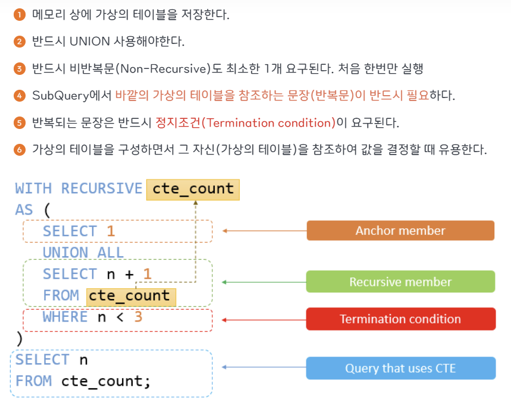

## 1번
[오프라인/온라인 판매 데이터 통합하기](https://school.programmers.co.kr/learn/courses/30/lessons/131537)

```SQL
SELECT DATE_FORMAT(SALES_DATE, '%Y-%m-%d') AS "SALES_DATE", PRODUCT_ID, USER_ID, SALES_AMOUNT
FROM ONLINE_SALE
WHERE SALES_DATE BETWEEN '2022-03-01' AND '2022-03-31'

UNION ALL

SELECT SALES_DATE, PRODUCT_ID, NULL AS USER_ID, SALES_AMOUNT
FROM OFFLINE_SALE
WHERE SALES_DATE BETWEEN '2022-03-01' AND '2022-03-31'

ORDER BY SALES_DATE ASC, PRODUCT_ID ASC, USER_ID ASC;
```

- 온라인/오프라인 데이터를 그대로 유지해서 둘 다 하나도 빠짐없이 가져와야 하니까 중복 제거 안되도록 UNION ALL 사용!
- OFFLINE_SALE 테이블의 판매 데이터의 USER_ID 값은 NULL 로 표시해달라는 조건은 ```NULL AS```로 해결 ^ㅅ^


## 2번


### 처음에 쓴 코드
```SQL
SELECT
    HOUR(DATETIME) AS HOUR,
    COUNT(ANIMAL_ID) AS "COUNT"
FROM ANIMAL_OUTS
GROUP BY HOUR(DATETIME)
ORDER BY HOUR(DATETIME);
```
아무 생각 없이 이렇게 풀었어염..

### 최종 코드
```SQL
WITH RECURSIVE hour_table AS (
    SELECT 0 AS hour
    UNION ALL
    SELECT hour + 1 FROM hour_table WHERE hour < 23
)
SELECT h.hour AS HOUR, 
       COUNT(a.DATETIME) AS COUNT
FROM hour_table h
LEFT JOIN ANIMAL_OUTS a
ON h.hour = HOUR(a.DATETIME)
GROUP BY h.hour
ORDER BY h.hour;
```
- 0~23시 결과를 모두 포함해야하는데 0시라는건 존재하지 않으니까 WITH RECURSIVE 사용

### WITH RECURSIVE
- 재귀 CTE, 본인의 값을 참조하는 테이블

    ```
    💡 CTE(Common Table Expression)

    - SQL에서 사용되는 기능으로 복잡한 쿼리를 간결하게 작성할 수 있게 해주는 임시 결과 집합
    - WITH 구문을 사용하여 쿼리 내에서 한 번 정의되며, 그 후에는 쿼리의 여러 부분에서 여러 번 ‘재사용’될 수 있음
    - 쿼리의 가독성을 향상하고, 복잡한 조인과 집계 로직을 간결하게 표현할 수 있도록 도움
    ```
    

    ```
    💡 WITH ~ CTE(Common Table Expression)

        - MySQL 8.0 이상 버전부터 지원하며 ‘임시 결과 집합’을 정의하여 ‘재 사용’하는 방식을 의미함 
        - 순서에 의한 절차적으로 작성을 하며, 간결하고 읽기 쉽게 만드는데 도움이 됨
    ```
    

### LEFT JOIN 사용 이유
- ANIMAL_OUTS 테이블에는 입양이 없는 시간대의 데이터가 존재하지 않음. 하지만? 조건에 따르면 ```0~23의 모든 시간대가 포함되어야 함```
- **hour_table을 기준으로 삼고 해당 시간대에 입양된 동물이 없는 경우에도 COUNT = 0이 나오도록 하기 위해** LEFT JOIN을 사용


